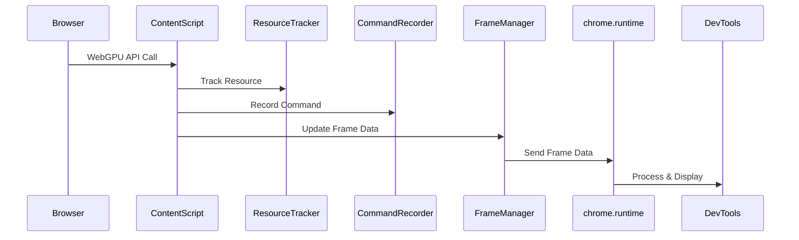

# WebGPU Monitor

## 介绍

WebGPU Monitor 的目标一个用于 WebGPU 性能分析工具（类似于 Renderdoc 但是完全基于浏览器）。它可以帮助开发者了解 WebGPU 的性能瓶颈，并提供优化建议。

## 运行

```sh
npm install
npm run dev
```

## 开发计划

### 思路

1. 如何拦截WebGPU的API调用
2. 如何记录WebGPU的调用栈，哪个部分的代码发起了特定的WebGPU操作（可能需要处理异步情况）
3. 资源追踪，跟踪这些资源的创建、修改和销毁，记录它们的状态变化，这样在分析时可以查看资源的使用情况，比如是否有未释放的资源导致内存泄漏。
4. 时间戳和性能数据的收集
5. 将API调用与实际的GPU操作对应起来，比如渲染通道、着色器执行
6. 数据存储和回放功能
7. 分析部分需要提供性能瓶颈的检测，比如检测频繁的API调用、资源泄露、渲染效率低的命令等。自动化分析可以通过预设规则，比如检测过多的纹理切换，或者过大的数据传输
8. 跨浏览器兼容性方面（优先考虑 chrome）


### WebGPU 分析插件的核心功能规划

**基础功能**

|功能|实现难度|必要性|技术方案|
|----|----|----|----|
|API 调用记录|★★☆|高|猴子补丁劫持 navigator.gpu 及所有子对象方法|
|资源生命周期追踪|★★★|高|WeakRef + FinalizationRegistry 跟踪资源销毁|
|帧边界标记|★★☆|高|劫持 queue.submit() 自动划分帧边界|
|基本性能统计|★☆☆|中|统计调用次数、耗时分布、数据传输量|
|JSON 数据导出|★☆☆|中|结构化日志 + 资源快照|

**进阶功能**

|功能|实现难度|必要性|技术方案|
|----|----|----|----|
|着色器热替换|★★★★|高|拦截 createShaderModule + 动态重编译|
|资源内容查看器|★★★★|中|通过 copyBufferToBuffer 窃取数据 + Canvas 可视化|
|依赖关系图谱|★★★☆|中|构建资源引用图 + D3.js 可视化|
|GPU 时间戳查询|★★★☆|高|注入时间戳指令 + 异步解析结果|
|自动化瓶颈检测|★★☆☆|中|基于规则的异常模式识别（如高频小 Buffer 上传）|

**高级功能**

|功能|实现难度|必要性|技术方案|
|----|----|----|----|
|跨帧状态比对|★★★★☆|低|差分算法对比资源状态变化|
|多线程支持|★★★★★|高|Worker 数据同步 + SharedArrayBuffer|
|实时回放引擎|★★★★★|中|虚拟 GPU 环境模拟 + 调用序列重演|
|浏览器集成调试|★★★☆|高|Chrome DevTools Protocol 深度整合|


### API Hook

通信主流程

```
["world": "MAIN"]
  ├── 劫持后的 navigator.gpu (main_world.js)
  └── 通过 postMessage 发送日志
          ↓
["world": "ISOLATED"] 
  ├── 接收消息 (isolated_world.js)
  └── 通过 chrome.runtime 转发到后台
          ↓
[扩展后台] 
  ├── 处理数据存储
  └── 推送至 DevTools 面板

```


### 插件通信流程

